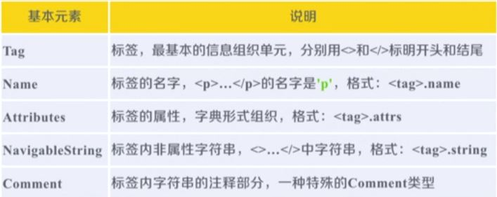
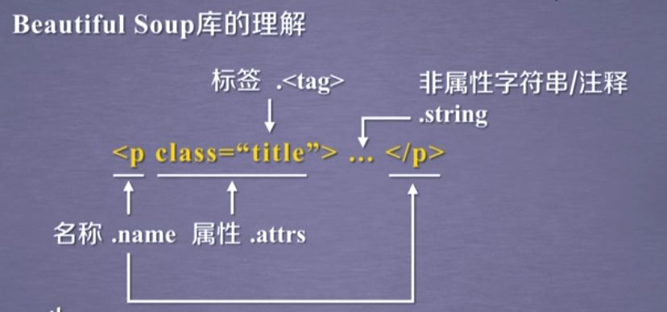
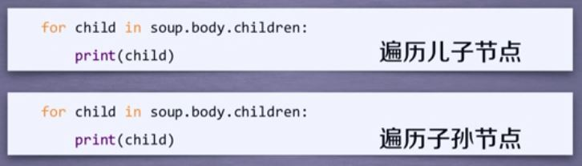
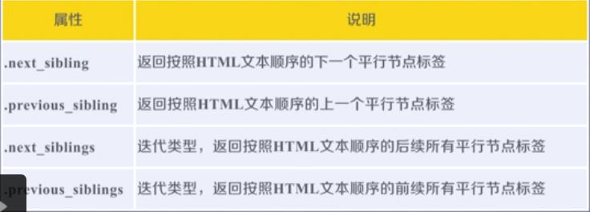
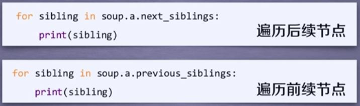
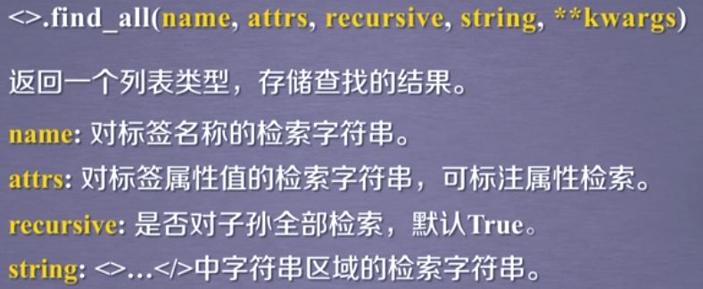
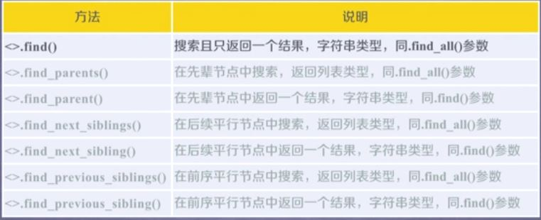

# 网络爬虫之信息提取

--------------------------------------------


## BeautifulSoup4

### 解析器


### 基本元素





### 遍历类型


> * 下行遍历：
>   * 
>   * **.contents**为列表类型，包含节点与'\n'，可以**.contents[1]**访问
>   * 
> * 上行遍历
>   * 
> * 平行遍历
>   * 
>   * 


## HMTL友好输出

```python
from urllib import request
from bs4 import BeautifulSoup
response = request.urlopen('https://www.cnki.net')
html = BeautifulSoup(response.read().decode('utf-8'), 'html.parser')
print(html.prettify())
```


## BS4库默认编码

> utf-8


## 信息标记类型

> 1. XML : 像HTML，有注释，有属性
>
>    ```xml
>    <hhh name="jjj"></hhh>
>    <hhh/>
>    <!--注释???-->
>    ```
>
> 2. JSON : 键值对，无注释，有属性
>
>    ```json
>    "name":"jys"
>    "name":["jys","hhh"]
>    "name":{
>        "new":"jys",
>        "old":"hhh"
>    }
>    ```
>
> 3. YAML：缩进，有注释，无属性
>
>    ```yaml
>    name :
>    	new : hhh
>    	old : jjj
>    hhh :    #(并列关系)
>    -999
>    -888
>    #整块信息
>    text : |6666666666666666666635555553333
>    ```

### 区别


### 使用


## 信息提取方法

> 1. 
> 2. 


## 正则表达式运用

```python
from urllib import request
from bs4 import BeautifulSoup
import re
response = request.urlopen('https://www.cnki.net')
html = BeautifulSoup(response.read().decode('utf-8'), 'html.parser')
print(html.find_all(re.compile("a*")))
```

输出：

```html
<a href="http://wap.cnki.net/cnkiclient.aspx" target="_blank">手机知网</a>
<a href="http://wuxizazhi.cnki.net/" target="_blank">杂志订阅</a>
<a href="http://mall.cnki.net/" target="_blank">数字出版物订阅</a>
<a href="http://bianke.cnki.net/" target="_blank">编创服务</a>
```


## Soup的find_all



```html
<tag>(...)等价于<tag>.find_all(...)
soup(...)等价于soup.find_all(...)
```




## 简单爬虫程序结构设计


## 扩展知识：format

```python
print('{1:^10},{2:{3}^10}kkkkkk{2:^5}'.format("555","???",555,chr(12288)))
```

输出：

```
   ???    ,　　　555　　　　kkkkkk 555 
```

中文空格：

```
chr(12288)
```

